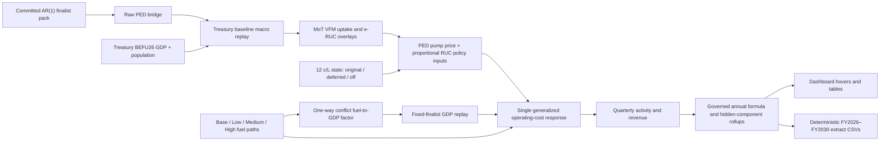

# Consultant handoff — Treasury baseline, conflict scenarios and 12 c/L policy

**Repository:** [AdrianD234/NLTF-revenue-ML-model-dashboard](https://github.com/AdrianD234/NLTF-revenue-ML-model-dashboard)  
**Branch for review:** `main`  
**Prepared:** 25 July 2026 (NZST)  
**Implementation commit:** [`be2664d`](https://github.com/AdrianD234/NLTF-revenue-ML-model-dashboard/commit/be2664d1712c0c78cd9ce1a68c7e2a924f349c5b)  
**Implementation parent:** [`e8f4af3`](https://github.com/AdrianD234/NLTF-revenue-ML-model-dashboard/commit/e8f4af38eea38a9bf92283083df352c30519c9ad)

This is the entry point for external review of the Revenue Outlook work completed
after the original EV/VFM handoff. The earlier evidence trail remains in
[`docs/CONSULTANT_HANDOFF.md`](CONSULTANT_HANDOFF.md). Read that first if the
review includes the MoT fleet-mix, EV-uptake or denominator rationale.

> **Update (20 August 2026):** the three-state 12 c/L selector described
> below has since been generalised to eight governed timing states
> (deferrals of 6 to 36 months in six-month steps). The semantics described
> here are unchanged and the six-month state is proven numerically
> identical; see
> [CONSULTANT_HANDOFF_FED_DEFERRAL_DURATION_2026-08-20.md](CONSULTANT_HANDOFF_FED_DEFERRAL_DURATION_2026-08-20.md).

## 1. Executive summary

The current model now does five things that the earlier implementation did not do
cleanly enough:

1. It uses the Treasury BEFU 2026 quarterly real-GDP path and population anchors
   as the governed baseline macro trajectory through 2030Q2.
2. It represents the 12 c/L FED policy as three unambiguous states—original
   timing, six-month deferral and no uplift—and applies the proportionate policy
   movement to RUC inputs over the same periods.
3. It offers Base, Low, Medium and High Middle East conflict fuel paths, each
   crossed with those three policy states: 12 governed paths in total.
4. It translates conflict fuel-price stress into a one-way real-GDP downside
   calibrated to two published Treasury scenario anchors, then lets the finalist
   models' GDP terms transmit that macro change into activity.
5. It reconciles dashboard hovers, annual/quarterly tables, Net FED, Net RUC,
   Net MVR, the six-row Fleet Mix explorer and the deterministic extract through
   the same transformation order.

The implementation is intentionally fail-closed. Missing source quarters,
partial numeric model replay, broken accounting identities, invalid GDP factors,
or a missing Treasury replay raise an error rather than silently returning the
legacy macro path or a visible-leaf approximation.

The most important remaining review judgements are not software defects. They
are whether the 75% petrol/25% diesel and 60% current/40% lagged GDP-stress
weights are acceptable; whether the explicit generalized-cost elasticity is the
best defence against price-response double counting; and whether a standalone
20% conflict-period RUC tax shock should be restored. These are called out in
section 12.

## 2. Version boundary and recommended review order

The Treasury/GDP extension is **not** part of `e8f4af3`. It is entirely contained
in `be2664d`, which has 26 changed files, 5,654 additions and 548 deletions.
This handoff and the cross-link in the earlier handoff are an immediately
following, documentation-only commit. That commit's own hash cannot be embedded
in itself without creating another commit; use `git log -1 --oneline` to identify
it.

Recommended review order:

1. This document.
2. `data/current_revenue_outlook/treasury_befu26_macro_path.csv`
   and `model_dashboard/treasury_macro_paths.py`.
3. `data/current_revenue_outlook/conflict_gdp_calibration.csv`
   and `model_dashboard/conflict_gdp_paths.py`.
4. `model_dashboard/fuel_price_scenario.py`.
5. `model_dashboard/revenue_outlook.py` and `model_dashboard/rate_paths.py`.
6. `model_dashboard/fleet_mix.py` and the related transition modules.
7. `scripts/materialize_conflict_scenario_extract.py`.
8. The six focused test files listed in section 10, followed by the broader
   Streamlit/cache/browser contract tests.

Useful Git commands:

```powershell
git show --stat be2664d
git diff e8f4af3..be2664d -- model_dashboard data/current_revenue_outlook
git diff e8f4af3..be2664d -- app.py scripts tests
```

## 3. Commit trail: what changed and why

| Commit | Purpose | Main defects or risks addressed | Evidence boundary |
|---|---|---|---|
| [`5235098`](https://github.com/AdrianD234/NLTF-revenue-ML-model-dashboard/commit/5235098) — Consultant handoff: the MoT-shape question, end to end | Consolidated the MoT/VFM/EV-uptake rationale and prior commit trail. | Replaced a distributed, hard-to-audit explanation with one external-review path. | Documentation only; see the earlier handoff. |
| [`5fee9fb`](https://github.com/AdrianD234/NLTF-revenue-ML-model-dashboard/commit/5fee9fb) — Fleet mix explorer | Added MoT's six volume rows across MBU26, VFM and the dashboard, with explicit share denominators. | Prevented “BEV share” from silently mixing all-road, all-light and light-RUC-pool denominators; excluded MBU years with missing petrol rows. | Commit records 10 new regressions and a 529-test pass at that boundary. |
| [`eebc557`](https://github.com/AdrianD234/NLTF-revenue-ML-model-dashboard/commit/eebc557) — Denominator handoff addendum | Added the BEV denominator warning to the first handoff. | Pre-cleared a likely consultant misinterpretation. | Documentation only. |
| [`c659b93`](https://github.com/AdrianD234/NLTF-revenue-ML-model-dashboard/commit/c659b939796799e743055f1b2187607241953532) — Governed revenue scenarios | Added the initial fixed-finalist fuel/RUC replay, 12 c/L timing schedules, independent Current/MBU controls, Net FED/RUC/MVR comparison and quarterly/annual reconciliation. Also moved the Fleet Mix chart and retained only the bottom CSV download. | Separated “six-month delay” from “uplift off”; made Current and MBU controls independent; clarified that `total_ruc_net_revenue` is net; prevented trace identity collapse and quarterly/annual drift. | 25 files, +4,550/−414. Added 38 test functions, but no single aggregate test summary was persisted in the commit. |
| [`849fce9`](https://github.com/AdrianD234/NLTF-revenue-ML-model-dashboard/commit/849fce95d93cbbdacc6f058bff54fee5140336aa) — Streamlit Cloud replay fix | Restored `statsmodels` to runtime requirements, added a legacy scikit-learn `_loss` import alias and validated numeric replay coverage before annual bridging. | Fixed the local-versus-Cloud failure that surfaced as `ValueError: The Iran-war replay could not be bridged to annual Revenue Outlook rows.` The real causes were missing Cloud runtime support and partial numeric replay. | 10 files, +252/−21; four focused regressions. |
| [`e8f4af3`](https://github.com/AdrianD234/NLTF-revenue-ML-model-dashboard/commit/e8f4af38eea38a9bf92283083df352c30519c9ad) — Governed Middle East fuel scenarios | Replaced the single stylised scenario with governed Low/Medium/High diesel and petrol paths; added the 12 internal policy variants, generalized-cost response, extract materializer and scenario audit UI. | Replaced stale workbook price anchors; kept source fuel paths policy-free; routed petrol to PED and diesel to conventional RUC; prevented separate fuel-plus-RUC elasticity compounding; preserved hidden revenue components and failed closed on incomplete replay. | 21 files, +8,916/−1,140; 40 new test functions. Treasury baseline GDP and the fuel-to-GDP channel were **not yet present**. |
| [`be2664d`](https://github.com/AdrianD234/NLTF-revenue-ML-model-dashboard/commit/be2664d1712c0c78cd9ce1a68c7e2a924f349c5b) — Treasury macro and conflict GDP transmission | Added the pinned BEFU26 baseline, one-way conflict fuel-to-GDP calibration, complete public 12-path matrix, three-state UI, formula-safe annual rollups, hover-aligned extract and Treasury-aligned Fleet Mix path. | Fixed weak baseline macro assumptions, missing macro effects in conflict scenarios, policy-history contamination, policy revenue without volume response, export/hover drift, petrol-VKT lineage mismatch, stale checkpoints and silent legacy-macro fallback. | 26 files, +5,654/−548. Final validation is in section 11. |

## 4. Current governed data flow



The production ordering is:

`bridge → Treasury macro → uptake/e-RUC → FED/RUC policy → conflict traces → annual formulas`

Changing this order can materially change the result. In particular, applying
uptake before Treasury or reconstructing the workbook from visible leaves can
reintroduce the discrepancies fixed in this work.

## 5. Baseline macro path

### 5.1 Source contract

`data/current_revenue_outlook/treasury_befu26_macro_path.csv` contains:

- official Treasury quarterly seasonally adjusted real-GDP levels from 2025Q2
  to 2030Q2;
- official June-quarter population anchors from 2025Q2 to 2030Q2;
- log-linear population interpolation for the intervening quarters;
- exact workbook sheet/cell lineage; and
- the source workbook SHA-256:
  `C6D48384C11295A00AAA0DA20E2BECFDDCF15D0A6203F810005F8905D5A9D391`.

Source workbook:
[BEFU 2026 supplementary charts and data](https://www.treasury.govt.nz/sites/default/files/2026-05/befu26-suppinfo-charts-data.xlsx).

The published annual-average real-GDP growth checks are:

| Fiscal year | FY2026 | FY2027 | FY2028 | FY2029 | FY2030 |
|---|---:|---:|---:|---:|---:|
| Real GDP growth | 1.2% | 2.3% | 3.2% | 2.7% | 2.5% |

### 5.2 Transformation mechanics

`model_dashboard/treasury_macro_paths.py`:

- holds the model's aggregate real-GDP dollar scale fixed at its 2026Q1 Base
  value;
- imports Treasury's relative quarterly GDP growth from that anchor;
- uses Treasury population to derive PED GDP per capita;
- uses common aggregate GDP for Light and Heavy RUC;
- rebuilds log, difference and GDP-price interaction features;
- continues the old model's quarter-on-quarter growth rates after 2030Q2,
  re-anchored to the Treasury endpoint; and
- asserts that fuel prices, FED rates, RUC rates and other price inputs are not
  changed by the macro transform.

This means the model imports Treasury's **growth profile**, not Treasury's
absolute GDP-dollar scale.

## 6. Conflict fuel-to-GDP transmission

### 6.1 Official anchors

`data/current_revenue_outlook/conflict_gdp_calibration.csv` pins:

| Scenario severity | Real-GDP level gap at 2027Q1 |
|---|---:|
| Medium | −1.5% |
| High | −3.1% |

Source:
[Treasury Aide Memoire T2026/568, Macroeconomic Scenarios — Middle East Conflict and Economic Impacts](https://www.treasury.govt.nz/sites/default/files/2026-05/mec-macroecon-scenarios-24-mar-2026.pdf),
page 5, paragraphs 21–22.

### 6.2 Model-derived transmission

`model_dashboard/conflict_gdp_paths.py` creates a transparent operating-cost
stress index:

- 75% weight on the petrol premium and 25% on the diesel premium;
- 60% weight on the current quarter and 40% on the lagged quarter; and
- a quadratic mapping calibrated exactly through the Medium and High Treasury
  anchors.

The Low path and every non-anchor quarter are derived from that mapping. They
are not official Treasury forecasts. The resulting factor is applied upstream
of the finalist replay:

- PED receives adjusted real GDP per capita;
- Light and Heavy RUC receive adjusted aggregate real GDP; and
- ordinary GDP changes never feed back into petrol, diesel, FED or RUC prices.

This is intentionally one-way: `fuel price → GDP → activity/revenue`. Reverse
`GDP → fuel price` feedback is prohibited and tested.

## 7. Policy states, prices and elasticities

### 7.1 The three 12 c/L states

| State | Timing | Behaviour |
|---|---|---|
| Original | 1 January 2027 | The 12 c/L FED step applies in 2027Q1–Q2, the final two quarters of FY2027. |
| Deferred six months | 1 July 2027 | The step begins in 2027Q3, the first quarter of FY2028. |
| Off | Never | The 12 c/L wedge is removed for the entire path. |

Consequences enforced by tests:

- Original and Deferred are identical in FY2026.
- Original exceeds Deferred for Net FED and Net RUC in FY2027.
- Deferred and Off are identical through FY2027.
- Original and Deferred coincide again from FY2028 onward.
- Deferred exceeds Off from FY2028 onward.
- MVR is invariant to all three states.

Current-model and MBU26 policy selectors are independent, including A/B compare
mode. MBU source rows are not overwritten; the selected rate/policy overlay is
applied to the displayed comparator path.

### 7.2 Proportionate RUC policy movement

The FED policy movement is included in the retail PED pump-price input. The
same target-versus-planned proportional movement is applied to Light and Heavy
RUC rate/model-price inputs for the governed periods, with required lag/lead
features rebuilt. This closes the earlier defect where the policy changed
revenue but not activity.

### 7.3 Why there is still an explicit price elasticity

The fixed finalist models retain their learned GDP and interaction effects.
However, their raw out-of-distribution price replay was not used as an
additional unconstrained price response. For governed price scenarios, the code
constructs a matched reference and applies one auditable structural response:

`matched forecast × generalized price ratio ^ governed elasticity × fitted GDP factor`

- PED uses the retail pump-price ratio.
- Conventional Light and Heavy RUC use one generalized running-cost ratio that
  combines diesel cost and RUC charge per 1,000 km.
- The price elasticity is applied once. Diesel and RUC are not compounded as
  two separate full shocks.
- Electric activity does not mechanically fall because diesel rises.
- Raw fitted forecasts and calibration inputs remain in audit columns.

The active Medium elasticities are:

| Stream | Elasticity | Source cell |
|---|---:|---|
| PED | −0.144116582 | `Inputs (TI)!D266` |
| Light RUC | −0.12 | `Inputs (TI)!D267` |
| Heavy RUC | −0.10 | `Inputs (TI)!D268` |

They come from `Revenue Model2.1 with fuel calcs.xlsx`, pinned by SHA-256
`54ed1cfee4fa533b655575ff41f59ba656f6c53350d52b9b02482bab1d16a3a7`.
The Light and Heavy RUC seeds are labelled as retail-diesel elasticities in the
source workbook. The scenario engine now applies them to the combined
diesel-plus-RUC generalized running-cost ratio. That is a deliberate
repurposing, not a source-workbook identity, and is a material consultant
judgement.

This separation was chosen to avoid double counting a sensitivity already
partly represented in the finalist model while retaining the finalist model's
GDP transmission. It remains a substantive modelling judgement for review.

## 8. Revenue and volume definitions

All displayed/exported revenue is `$m nominal ex GST`.

| Series | Governed definition |
|---|---|
| Net FED | `gross_fed_revenue - fed_refunds` |
| Net RUC (all classes) | `gross_ruc_revenue - ruc_admin_revenue - ruc_refunds` |
| Net MVR | `mr1_revenue + mr2_revenue - mvr_admin_revenue - mvr_refunds` |

The canonical ID `total_ruc_net_revenue` is deliberately retained:
**“total” means all RUC classes; the value is net**, not gross.

The six Fleet Mix volume rows are:

1. Light petrol VKT.
2. Light conventional RUC km.
3. Light BEV RUC km.
4. PHEV RUC km.
5. Heavy conventional RUC km.
6. Heavy BEV RUC km.

The final review found that `load_dashboard_frame()` still omitted the Treasury
macro overlay even though Revenue Outlook used it. That was corrected in
`be2664d`: the Fleet Mix Dashboard source now follows
`raw bridge → Treasury macro → VFM uptake`. Its FY2030 light-petrol-VKT gap
versus MBU is approximately −5.87%, replacing the stale −7.42% legacy-macro
checkpoint, while PED litres and petrol VKT retain the same governed fuel
intensity.

## 9. File map for `be2664d`

| Files | Responsibility |
|---|---|
| `treasury_befu26_macro_path.csv`, `treasury_macro_paths.py` | Pinned Treasury baseline, source/hash validation, feature rebuilding and post-2030 continuation. |
| `conflict_gdp_calibration.csv`, `conflict_gdp_paths.py` | Official Medium/High anchors and one-way quarterly GDP factors. |
| `fuel_price_scenario.py` | 12-path registry, Treasury and conflict replays, policy-price inputs, generalized-cost response, GDP audit and annual factors. |
| `rate_paths.py`, `revenue_outlook.py` | Policy timing schedules, explicit net definitions, formula-safe chart/export bridges and cache signatures. |
| `app.py` | Three-state Current/MBU/A/B controls, governed layer order, explanatory copy, audit exposure and fail-closed fallback. |
| `fleet_mix.py`, `ev_uptake_levers.py`, `eruc_transition.py` | Petrol-VKT/PED lineage, class-pool preservation, e-RUC migration and Treasury-aligned explorer data. |
| `forecast_runner.py` | More portable actual-period discovery through CSV fallback when Parquet is unavailable. |
| `materialize_conflict_scenario_extract.py` | Deterministic FY2026–FY2030 CSV sources built through the same dashboard pipeline. |
| Tests listed in the implementation commit | Source values, replay completeness, accounting formulas, timing identities, UI state isolation, cache behaviour, browser selectors and cross-view reconciliation. |

## 10. Defect and error register

| Symptom / error | Root cause | Resolution | Regression evidence |
|---|---|---|---|
| Streamlit Cloud raised `The Iran-war replay could not be bridged to annual Revenue Outlook rows.` | Cloud runtime lacked `statsmodels`; old scikit-learn fitted states referenced the historical top-level `_loss`; partial numeric forecasts reached the annual bridge. | Restored runtime dependency, added compatibility alias, and rejected partial replay before bridging. | `test_conflict_replay_rejects_partial_numeric_stream_coverage`; deployment-readiness and Cloud-focused tests. |
| “Off” was ambiguous. | A binary toggle conflated six-month deferral with permanent removal. | Replaced it with Original / Deferred / Off for Current and MBU26 independently. | Nine-state Current × MBU isolation test; timing-matrix tests. |
| 12 c/L changed revenue but not volume. | The policy wedge was applied to rates/collections without entering pump/generalized operating cost. | FED enters PED pump price; proportional RUC movement enters Light/Heavy inputs; one governed demand response recalculates activity. | Pump-price sign check; generalized-cost formula check; FY2027 Original activity below Deferred. |
| Fuel and RUC responses could be double counted. | Separate price ratios could each apply a full elasticity. | Combined diesel plus RUC into one per-1,000-km generalized-cost ratio and applied elasticity once. | `single_generalized_cost_elasticity_conventional_ruc`. |
| Original and Deferred remained different after schedules rejoined. | Heavy-RUC policy history contaminated the GDP/policy factor. | Policy variants inherit their published conflict-family GDP factor; identity/downside guards were added. | FY2028+ maximum difference `3.64e-12`, effectively zero. |
| Lower GDP could mechanically increase activity. | Some fitted interactions can produce the wrong sign out of distribution. | Identity and downside sign guards constrain the governed scenario overlay. | GDP identity, ordering and sign tests. |
| Annual Net FED/RUC totals drifted from leaves. | Multiplicative aggregate factors lost fixed LPG/CNG/refund/admin and hidden Heavy-BEV components; missing anchors could be treated as zero. | Rebuilt annual additive deltas and governed formulas; missing anchors remain missing and fail closed when required. | Formula residual checks; hidden-component preservation; missing-factor tests. |
| Extract figures differed from dashboard hovers. | The extract did not reproduce the exact bridge/macro/uptake/policy/conflict order and chart rebasing. | Materializer now calls the dashboard-aligned annual bridge and authoritative replay. | 21/21 extract validations; independent formula and hover tests. |
| Petrol VKT and PED litres diverged. | Petrol VKT used an optimized migration audit while PED litres used the selected raw bridge. | Added explicit `light_petrol_vkt` to the PED lineage and scales VKT, litres and FED together. | Intensity reconciliation maximum error at floating-point tolerance. |
| Fleet Mix still showed the legacy macro path. | Its helper stopped at bridge plus VFM uptake. | Inserted the Treasury replay before uptake and updated the class-pool test. | 11/11 `test_fleet_mix.py`; full suite pass. |
| Conflict replay failure could silently show legacy GDP. | Treasury macro depended only on the conflict replay object. | Added an independent Treasury baseline replay; raise if both are unavailable. | Fallback-survival and fail-closed cache tests. |
| Hover/checkpoint tests failed after macro correction. | Stored expected values represented the old macro path. | Reconciled formulas first, then refreshed checkpoints to authoritative values. | Full suite pass at `be2664d`. |
| A full test run initially produced many failures. | It was accidentally launched with global Conda Python rather than the repository `.venv`. | Stopped that run, reran first-failure diagnostics and the complete suite with `.venv`. | Final `.venv` result: 611 passed. |

## 11. Validation evidence

### 11.1 Final retained results

| Check | Result | Date / boundary |
|---|---|---|
| `.\.venv\Scripts\python.exe -m compileall .` | PASS, exit 0 | 25 July 2026, final local contents used for `be2664d`. |
| Complete `.venv` pytest suite | **611 passed, 50 skipped, 41 deselected, 8 warnings in 1,459.38s**, exit 0 | 25 July 2026, final local contents used for `be2664d`. |
| Fleet Mix reconciliation | **11 passed in 22.72s** | 25 July 2026, after inserting Treasury macro into the explorer path. |
| Fresh deterministic extract | 240 assumption rows, 1,860 revenue rows, 600 activity rows; **21/21 validations passed** | 25 July 2026. |
| Remote implementation parity | **26/26 file blobs match local validated contents; no extra paths** | `be2664d` is the single linear child of `e8f4af3`. |
| Streamlit deploy-readiness | PASS | 25 July 2026, final local contents used for `be2664d`. |
| Host Chromium dashboard suite | **40 passed in 161.91s** | 24 July 2026, after Treasury/GDP changes and before the final Fleet Mix helper correction. |
| Focused all-page browser render | 1 passed | 24 July 2026. |
| Formatted workbook inspection | 12 paths, 10 sheets, zero formula-error matches | Local v3 workbook generated 24 July 2026; see the reproducibility limitation below. |

Both browser results predate the final Fleet Mix Treasury-helper correction in
`be2664d`. The complete final pytest suite and the 11-test Fleet Mix suite cover
that logic, but the exact final implementation was **not** rerun through host
browser verification. The consultant should include a fresh host-browser pass
in formal sign-off.

The final pytest process emitted a Windows temporary-directory cleanup
`PermissionError` **after** pytest printed the complete passing summary and the
bounded wrapper returned exit code 0. It did not alter the test result.

Bare Streamlit tests also emit `missing ScriptRunContext` warnings, and the live
app log still contains `use_container_width` deprecation warnings. These are
recorded as environment/API maintenance items, not scenario-calculation errors.

### 11.2 Fresh extract checks

The 21 checks include:

- 12 internal scenarios and 12 exported paths;
- Treasury macro stream consistency and policy-state GDP identity;
- exact Medium −1.5% and High −3.1% Treasury anchors;
- petrol-VKT/PED-litres intensity reconciliation;
- no embedded 12 c/L wedge in source fuel paths;
- fuel-source lineage and observation status;
- nominal/real FED policy ratio identity;
- Net FED, Net RUC and Net MVR formula closure;
- no future-severity leakage into common FY2026 rows;
- no diesel spillover to electric activity;
- FY2026/FY2027 and FY2028+ timing identities;
- FY2027 revenue and activity signs;
- a single generalized-cost elasticity; and
- higher conflict prices lowering direct conventional activity.

### 11.3 Commands to reproduce

```powershell
# From repository root
.\.venv\Scripts\python.exe -m compileall .

& .\scripts\invoke_bounded.ps1 `
  -Label consultant-pytest-all `
  -TimeoutSeconds 1800 `
  -FilePath .\.venv\Scripts\python.exe `
  -Arguments @("-m", "pytest", "-q")

.\.venv\Scripts\python.exe scripts\materialize_conflict_scenario_extract.py `
  --output-dir outputs\consultant_review\conflict_scenario_extract

Import-Csv outputs\consultant_review\conflict_scenario_extract\conflict_scenario_validation.csv |
  Format-Table check_id, passed, observed -AutoSize

.\.venv\Scripts\python.exe scripts\check_streamlit_deploy_readiness.py

pwsh -NoProfile -File scripts\start_streamlit_bounded.ps1 `
  -Port 8501 -StartupTimeoutSeconds 90

# Run this from the approved host/outside-sandbox shell on Windows.
pwsh -NoProfile -File scripts\verify_browser_host.ps1 `
  -Python .\.venv\Scripts\python.exe -Port 8501
```

Always use the repository `.venv`; global Conda Python is not a valid
verification environment for this checkout.

## 12. Fish hooks and decisions requiring consultant judgement

### 12.1 The exact formatted XLSX is not reproducible from a clean clone

The checked-in materializer reproducibly builds four source CSVs. The local
formatted workbook
`NLTF_middle_east_conflict_scenarios_FY2026_FY2030_v3.xlsx` has 10 sheets and
was visually/formula inspected, but:

- `.gitignore` excludes `outputs/` and `*.xlsx`;
- the workbook and validation logs are therefore not visible on GitHub; and
- no checked-in script currently recreates the exact formatted 10-sheet XLSX.

For formal assurance, either:

1. review the deterministic CSVs produced by the committed materializer;
2. have the owner share the v3 workbook separately; or
3. promote the workbook builder into a durable checked-in script in a later
   commit.

Do not treat the ignored workbook or local logs as evidence available from the
repository.

### 12.2 Conflict RUC shock needs an explicit policy decision

The current governed Low/Medium/High conflict paths do **not** apply a standalone
20% RUC tax-rate shock. Conflict fuel prices remain separate from RUC tax policy;
RUC inputs change only through the proportional 12 c/L policy treatment.

This was chosen to avoid implying that a fuel-supply conflict automatically
changes statutory RUC rates. However, an earlier exploratory instruction asked
for a +20% RUC input increase over the conflict period. The consultant and owner
should explicitly confirm which interpretation is wanted before treating the
scenario set as final policy advice.

### 12.3 GDP calibration is governed, not causal estimation

- Only the Medium and High 2027Q1 GDP gaps are official Treasury anchors.
- The Low path, quarterly shape and recovery profile are model-derived.
- The 75/25 fuel weights, 60/40 current/lag weights and quadratic mapping are
  transparent scenario assumptions, not statistically estimated causal
  elasticities.
- Low and Medium GDP recovery occurs one quarter after their fuel paths because
  of the lagged stress term; High remains stressed longer.

The consultant should inspect the implied quarterly factors and challenge these
weights directly.

### 12.4 Sign guards can bind

Identity and downside guards prevent a lower-GDP scenario from mechanically
raising activity. They are a governance overlay, not a re-estimation of the
econometric model. Review:

- how many rows bind;
- whether clipping at identity is acceptable; and
- whether repeated binding indicates the relevant finalist should be
  re-estimated for policy simulation.

### 12.5 Division of labour between learned model effects and elasticity

The explicit generalized-cost elasticity is used once for governed price
scenarios, while learned finalist GDP effects transmit the macro path. The
consultant should confirm that this is preferable to:

- relying entirely on the raw fitted price response out of distribution;
- re-estimating a structural activity model; or
- presenting a wider elasticity range rather than one Medium calibration.

In particular, review whether applying retail-diesel elasticity seeds to the
combined diesel-plus-RUC generalized-cost ratio is economically defensible, or
whether new generalized-cost elasticities should be estimated.

### 12.6 Baseline and source updates

- BEFU26 is pinned by exact cells and workbook hash. A new Treasury release will
  intentionally fail or remain unchanged until the governed CSV is updated.
- Population between June anchors is interpolated rather than officially
  published quarterly.
- After 2030Q2, the previous model's quarterly growth resumes from the new
  endpoint.
- MVR is held invariant to fuel, RUC-price and GDP scenario overlays.
- No production telemetry or Sentry issue evidence was reviewed in this pass.

## 13. Consultant acceptance checklist

The consultant should be able to answer “yes” or record a finding against each:

- [ ] The BEFU26 GDP values, population anchors, source cells and workbook hash
      reconcile to the cited Treasury workbook.
- [ ] Re-anchoring at 2026Q1 and resuming the old quarterly path after 2030Q2
      are acceptable.
- [ ] PED uses GDP per capita while both RUC streams use common aggregate GDP.
- [ ] The Medium/High conflict GDP anchors match the Treasury note.
- [ ] The derived Low path and quarterly recovery shape are reasonable.
- [ ] The 75/25 and 60/40 stress weights are defensible.
- [ ] One-way fuel-to-GDP transmission is appropriate and reverse feedback
      should remain out of scope.
- [ ] Original, Deferred and Off policy timing is correctly interpreted for
      FY2026–FY2030.
- [ ] The proportional RUC treatment of the 12 c/L policy is acceptable.
- [ ] The absence/presence of a standalone +20% conflict RUC shock is decided.
- [ ] The single generalized-cost elasticity does not double count the finalist
      model's estimated sensitivity.
- [ ] Repurposing retail-diesel elasticity seeds for combined diesel-plus-RUC
      generalized cost is acceptable, or replacement estimates are specified.
- [ ] Net FED, Net RUC and Net MVR formulas match the intended accounting
      definitions.
- [ ] Hidden LPG/CNG/refund/admin/Heavy-BEV components survive annual rollups.
- [ ] Dashboard hover, Fleet Mix and extract values reconcile on selected
      checkpoints.
- [ ] Guard-binding rows are reviewed and do not conceal model instability.
- [ ] The deterministic CSV materializer is sufficient, or a durable XLSX
      builder is commissioned.

## 14. Bottom line

The current implementation is materially more defensible than the prior
version: baseline macro assumptions are source-pinned; conflict scenarios
transmit through both direct operating cost and GDP; the 12 c/L timing states
are explicit; revenue definitions close; volumes respond; and dashboard/export
paths share one governed pipeline.

The remaining uncertainty is now visible rather than accidental. It sits in
policy and modelling choices—the conflict-period RUC assumption, the
fuel-to-GDP calibration weights, and the structural elasticity—not in ambiguous
switches, silent fallback, missing runtime dependencies or mismatched workbook
arithmetic.
